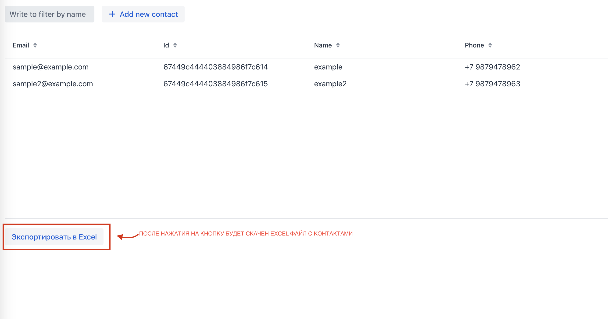

# Тестовое задание, crud на spring с использованием vaadin и mongodb

## Запуск:
### Перед запуском необходимо убедиться в том, что запущен docker, это можно сделать командой 
> docker ps
### Потом запускаем проект (билд проходит около 250 секунд из-за генерации js), просьба подождать
> docker compose up
### Все окружение будет поднято, а приложение развернуто на localhost:8080

### В левом верхнем углу поле для фильтрации строк, фильтр работает по имени (name)

### Кнопка add new contact открывает окно для создания нового контакта

### Чтобы редактировать или удалить существующий контакт, необходимо нажать на него

### Кнопка "Экспортировать в Excel" добавит в загрузки excel файл с данными из таблицы, для последующей печати

## Для администрирования mongo db, можно зайти на 
> localhost:8081 Креды:
> Пароль: admin Пароль: pass

